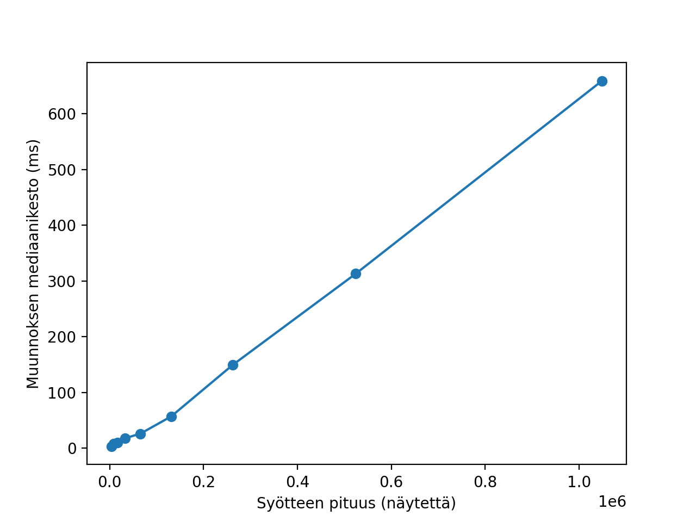

# TaajuusTane testausdokumentti

## Strategia
Projektin testit on jaoteltu yksikkötesteihin, suorituskykytesteihin ja hyväksyntätesteihin. Yksikkötesteillä testataan luokkien, kuten `Analyysi`, `Fourier`, `Kompleksi` ja `Tallenne` julkista rajapintaa. Suorituskykytesteillä tarkkaillaan eniten aikaa vievien osien suorituskykyä ja hyväksyntätesteillä varmistetaan ohjelmakokonaisuuden toiminta. Kaikki testit ajetaan osana projektin Github Actions -ajoa, joka tapahtuu aina versionhallinnan `main`-haaran päivittyessä.

### Yksikkötestaus

Yksikkötesteillä testataan luokkien julkisten rajapintojen toiminnan oikeellisuutta. Yksikkötestien ajoon kuluva aika pyritään pitämään pienenä kehityksen sujuvuuden vuoksi. Testattavan luokan ulkopuoliset metodit ohitetaan ja palautetaan korvaavista mock-toteutuksista testidataa. Useassa tapauksessa oikeellisuus varmennetaan vertaamalla saatuja arvoja käsin laskettuihin, oikeaksi tiedettyihin arvoihin.

`Tallenne`-luokan testaus poikkeaa muista siten, että testeissä ei ohiteta luokan ulkopuolisia riippuvuuksia, vaan testi lukee tiedostoja oikeasta tiedostojärjestelmästä. Äänitiedostosta luku ja tiedoston attribuuttien validointi testataan `app/src/test/resources/` kansiosta löytyvillä `kymmenykset` Wav-tiedostoilla. Nämä tiedostot on generoitu `skriptit/genwav.py` python-skriptillä. Tiedoston luvun keskellä tapahtuvaa virhettä ei tällä lähestymisellä kuitenkaan saa testattua. Myöskään Big Endian -muotoisen Wav-tiedoston validointia ei testattu tällaisen tiedoston luomisen työläyden vuoksi.

Yksikkötestit voi suorittaa seuraavalla komennolla:
```
./gradlew test
```
Komennon suoritus luo testiraportin polkuun `app/build/reports/tests/test/`, sekä testikattavuusraportin polkuun `app/build/reports/jacoco/test/html/`.

### Suorituskykytestaus

Suorituskykytesteillä testataan `Fourier.muunnos` metodin nopeutta. Wav-tiedostot vievät paljon tilaa, joten testaamisessa käytetty signaali (440Hz siniaalto) generoidaan testien suorituksen yhteydessä. Koska käyttämämme algoritmi suoriutuu vain kahden potensseista, tehdään testaus kahden potenssien pituisilla syötteillä. Käytetään pituuksia 2^12, ..., 2^20, sillä näilläkin yksittäinen muunnos vie (testatulla laitteistolla) joistain millisekuinneista aina useisiin satoihin millisekunteihin.

Suorituskykytestit voi suorittaa seuraavalla komennolla:
```
./gradlew perftest
```
Komennon suoritus luo testiraportin polkuun `app/build/reports/tests/perftest/`. Testien tulokset löytyvät HTML-raportista navigoimalla TaajuusTane > FourierSuorituskykyTesti näkymään ja klikkaamalla "Standard output". Myös CSV-muotoinen esitys tallentuu samaan kansioon. CSV-tiedoston pohjalta voi luoda visualisaation käyttämällä projektin sisältämää python-skriptiä sijainnissa `skriptit/perfplot.py`.



Suorituskykytestien ajot noudattelevat tämän pohjalta silmämääräisesti O(N log N) aikavaativuutta.

### Hyväksyntätestaus

TODO
